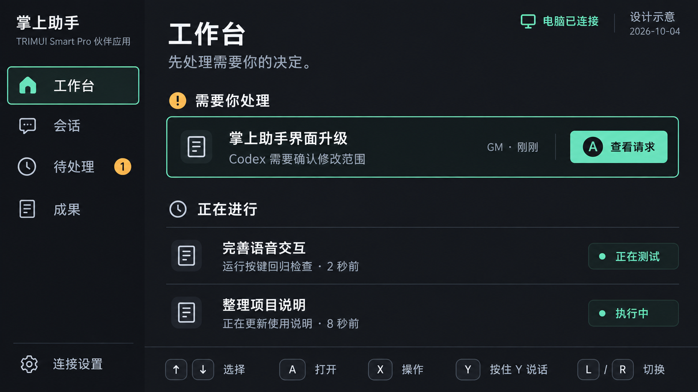
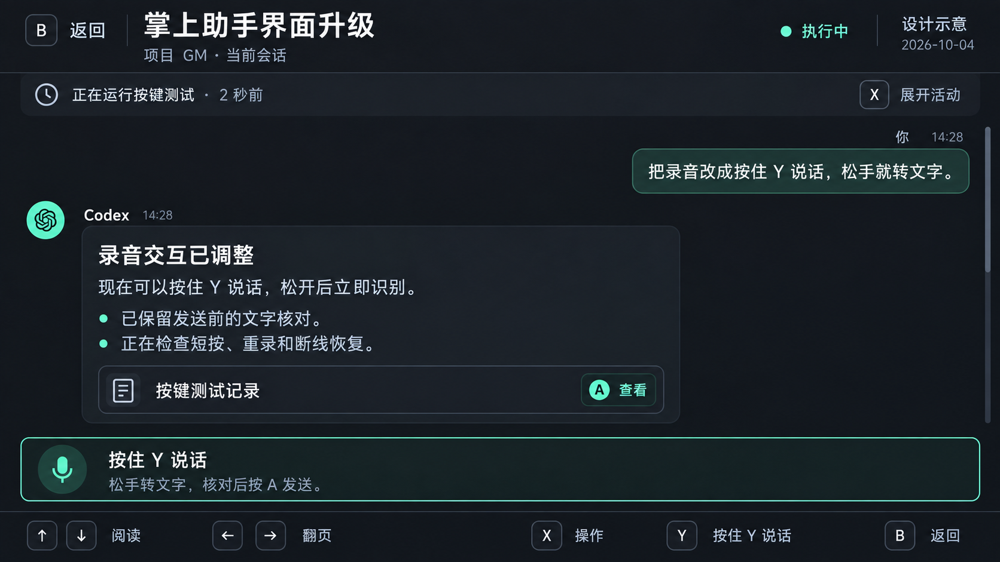
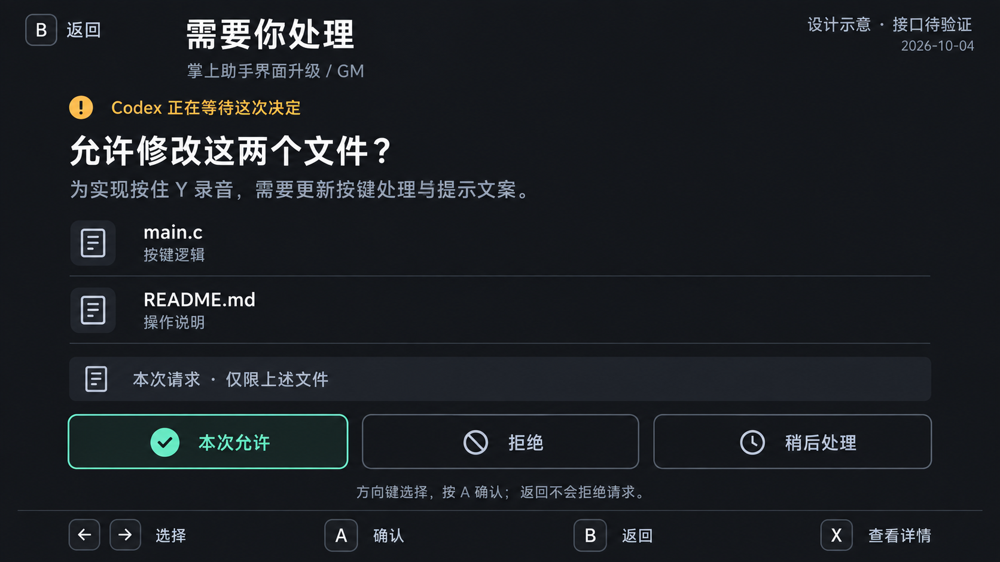

# 掌上助手 页面与交互设计

日期：2026-10-04。三张图为同一产品的配套页面设计示意，不是三个互相排斥的方案。它们尚未部署到掌机，也不代表图中的接口已实现。

## 视觉目标

以暗石墨色底、清晰中文正文、少量薄荷绿和琥珀色建立统一界面。主要内容依靠间距、字重和分隔线组织，不依靠大量卡片、装饰或数字。

实现画布为 1280×720。生成图原始分辨率为 1672×941，仅用于视觉方向，不能直接缩成整屏图片当成应用。实际实现按 1280×720 重新布局并检查中文可读性。

| 项目 | 实现基线 |
| --- | --- |
| 页面底色 | #17191E；阅读内容可沿用当前 #14171D |
| 导航底色 | #121419 |
| 主文字 | #E4E6EB |
| 次级文字 | #A7AEB8，必要时提高对比度 |
| 焦点与连接 | #73DDBD；必须同时有形状/文字区别 |
| 等待处理 | 琥珀色；不能只靠颜色表达 |
| 字号 | 正文 26px、辅助文字 22px、页面标题 32～34px；支持大字模式 |
| 间距 | 8px 基础单位；页面边距 24～32px；行高按字体实测 |
| 焦点 | 明确描边和局部底色；全屏只允许一个可操作焦点 |
| 图标 | 统一描边体系；实施时使用有许可的图标库，不能切割生成图充当图标 |

## 工作台

目的：打开就知道最需要关注什么。左侧导航承载模块位置，主区突出待处理请求，其次是运行中任务。小屏显示不过多任务，允许按组滚动。

交互：上下移动任务焦点，A 打开；L/R 切换一级模块；X 打开当前任务操作菜单。后台排序变化保持任务 ID 对应的焦点。

必须补齐的状态：无任务、全部空闲、多个待处理、离线缓存、首次配对、正在恢复连接。没有待处理时收起该分区，不能保留空大卡片。

## 会话

目的：连续阅读、理解最近活动并继续安排工作。阅读页折叠侧栏，保留任务标题、项目和可信状态。用户与助手通过位置、署名和视觉分组区分。

交互：上下滚动、左右翻页；按住 Y 说话；A 打开焦点内容或确认草稿；B 返回。图片/表格进入专用阅读模式后，上下左右操作内容，B 退出专用模式。

新回复不得打断历史阅读。处于历史位置时显示“有新回复”；焦点移至它后 A 回到底部。用户草稿出现时收起普通录音提示，显示目标、可编辑文字和发送/重录/放弃。

必须补齐的状态：识别准备中、正在录音、识别中、待发送、发送中、已受理、结果未知、失败、历史加载失败、媒体不可用。

## 待处理

目的：清楚知道自己在决定什么。优先显示任务、原请求、原因和实际影响范围。长命令或较大范围必须可展开查看。

交互：方向键选择源端提供的有效选项，A 提交，B 返回且不作决定，X 查看原请求详情。“稍后处理”只关闭当前页面；若源端另有延期语义，必须明确区分。

图中“仅限上述文件”为示意请求的假定范围。实际请求若不能限制文件范围，不得沿用此文案。图中的允许/拒绝必须等原审批接口验证后才启用。

必须补齐的状态：请求已在电脑处理、请求过期、连接丢失、提交中、源端拒绝、结果未知、不支持该动作。

## 统一按键

| 按键 | 常规页面 | 特殊情境 |
| --- | --- | --- |
| 方向键 | 选择/滚动；会话左右翻页 | 图片平移，草稿选词，审批选项切换 |
| A | 打开焦点项目 | 确认发送或提交当前明确决定 |
| B | 返回一级 | 退出预览；草稿放弃前给出可恢复路径；不会拒绝审批 |
| X | 当前页面操作菜单 | 请求页查看详情；菜单中提供展开活动、成果和受支持控制 |
| Y | 按住说话，松手转文字 | 草稿重录；决定页面不允许语音误触直接提交 |
| L/R | 一级模块切换 | 在二级流程中不静默丢失未提交草稿 |
| START | 设置/应用菜单 | 包含显式退出 |
| SELECT | 保留现有退出兼容入口 | 有未提交草稿先保存；不停止电脑任务 |

L/R 与 START 在最终固件上的编号仍需实测；不得沿用未经确认的其他设备映射。已验证的实体 A/B/X/Y 映射保留。

## 实施前必须修正的样稿细节

1. 工作台左侧“当前模块”和主区“操作焦点”不能同时使用完整高亮描边。前者用文字/图标颜色，后者保留唯一焦点描边。
2. 会话图中 X 同时标为“展开活动”和“操作”。实现统一为 X 打开操作菜单，展开活动放在菜单内；如活动行为有独立焦点，则用 A 打开。
3. 待处理图中“本次允许”的高亮用于呈现主操作样式。进入请求页默认焦点放在详情区域；用户读完后自行移到决定，不能因初次按 A 就误许可。
4. 助手图标在实施时使用明确许可的统一图标，不把生成图中的品牌近似图形直接作为产品资产。
5. 页面字幕、图标和正文按实际设备检查；设计图中的小字不能因比例缩放降到不可读。

这些是样稿评审发现的修改要求，不应当作已修复界面。后续可运行版必须逐项落实并重新截图对照。

## 生成记录

方式：内置 Image Gen，三次独立生成。第一张参考当前真机详情页 product-review-detail.png；后两张参考第一张以保持同一视觉体系。全部示意数据均标注为设计示意，时间基准 2026-10-04。

提示词共同要求：1280×720 横向应用画面；中文大字；暗石墨底、薄荷绿焦点、琥珀色待处理；实体按键提示；不出现设备外壳、图表或虚构进度百分比；审批页标注“接口待验证”。完整生成提示词保存在 [IMAGE_PROMPTS.md](IMAGE_PROMPTS.md)。
